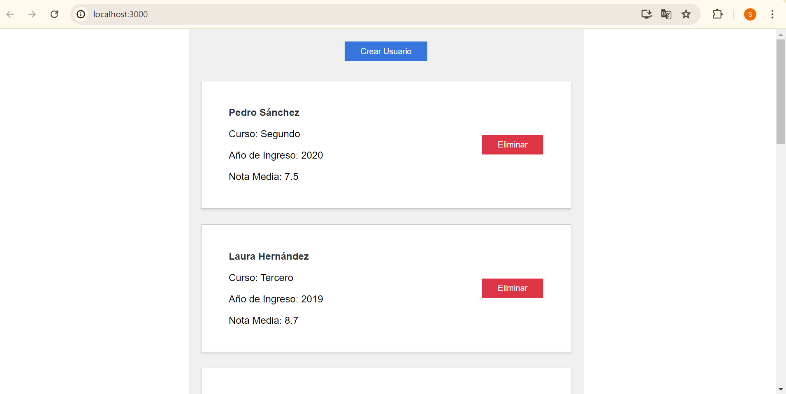
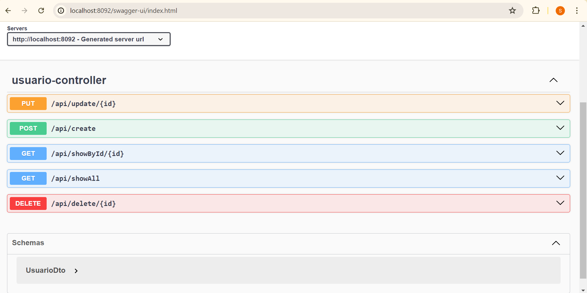

# Instalación

Para utilizar este proyecto, asegúrate de tener instalados los siguientes componentes:

## MySQL

- **Versión**: MySQL 8.0.37
- **Descarga**: [MySQL 8.0.37](https://dev.mysql.com/downloads/mysql/)
- **Herramienta de administración**: MySQL Workbench 8.0.36
- **Descarga**: [MySQL Workbench 8.0.36](https://dev.mysql.com/downloads/workbench/)
- **Servicio**: MySQL80
- **Usuario**: root
- **Contraseña**: Password
- **Puerto del servicio**: localhost:3306
- **Base de datos**: ejecute el script beca.sql en MySQL Workbench para que la base se construya

## Node.js

- **Versión**: Node.js 20.15.0
- **Descarga**: [Node.js 20.15.0](https://nodejs.org/en/download/prebuilt-installer)
- **Nota**: Si al ejecutar la aplicación de React no encuentra la ruta `../AppData/Roaming/npm`, ejecuta el siguiente comando desde CMD como administrador: `npm install -g npm@latest`. A veces, el instalador de Node.js no crea esta carpeta automáticamente. Si dicha ruta se ha creado o no podrá saberlo cuando corra el frontend.

## JDK (Java Development Kit)

- **Versión**: JDK 21
- **Descarga**: [JDK 21](https://www.oracle.com/es/java/technologies/downloads/#jdk21-windows)

## Apache Maven

- **Versión**: Maven 3.9.8
- **Descarga**: [Apache Maven 3.9.8](https://maven.apache.org/download.cgi)

# Ejecución

A continuación se detallan los pasos para ejecutar cada parte del proyecto.

## Base de Datos MySQL

La base de datos debe ejecutarse utilizando MySQL Workbench. Asegúrate de que el servicio MySQL80 esté activo y conectado con las credenciales proporcionadas (usuario: root, contraseña: Password).

## Backend (API)

Compile y ejecute el código a su elección: entorno de desarrollo como VSC o Eclipse, la línea de comandos CMD...

En mi caso (Windows 11 Pro), desde el CMD me situé en el directorio beca_backend, ejecuté "mvn clean install" para generar el ejecutable jar en la carpeta target y luego ejecuté "java -jar target/beca_backend-0.0.1-SNAPSHOT.jar" para correr la aplicación.

## Frontend (React App)

Compile y ejecute el código a su elección: entorno de desarrollo como VSC o Eclipse, la línea de comandos CMD... Pero antes debe tener corriendo el backend y la base de datos.

Recuerde realizar primero "npm install" para asegurar que todas las dependencias están instaladas.

En mi caso, me situé en el directorio beca_frontend y, tras instalar las dependencias, ejecuté la aplicación mediante "npm install".

# Descripción de la app

La app permite visualizar una lista de registros de usuarios que tienen los atributos nombre, apellidos, curso, año de ingreso y nota media. Dicha lista puede ser modificada mediante la adición o eliminación de registros.

La API está diseñada para permitir más funcionalidades que la eliminación o adición de registros las cuales podemos ver a través del swaggger (url de la imagen a continuación):

Por falta de tiempo (pues se evitó sobrepasar las 4 horas de trabajo) no se implementaron más funcionalidades a la app.

El backend sigue una arquitectura en capas:
- Capa de presentación. Maneja la comunicación con el usuario y las solicitudes HTTP. Es responsabilidad del controlador (UsuarioController).
- Capa de servicio. Contiene la lógica de negocio, orquesta operaciones y actúa como intermediario entre la capa de presentación y la capa de persistencia. Es responsabilidad del servicio (UsuarioService).
- Capa de Persistencia. Gestiona la interacción con la base de datos y realiza operaciones CRUD sobre las entidades del dominio. Es responsabilidad del DAO (UsuarioDAO).

El backend distingue entre interfaces y sus implementaciones así como entre datos DTO y Entidades (aunque para el caso sencillo de esta app no es necesario nada de esto, es buena práctica para cualquier proyecto que sea algo más grande). El control de errores es básico: devolver código de error y mensaje de error.

El frontend define todo su código HTML, CSS y JS que interactúa directamente con el usuario en App.js y App.css. Por otra parte, el archivo api.js contiene el código con las llamadas al backend. El control de errores es básico: devolver mensaje de error.

